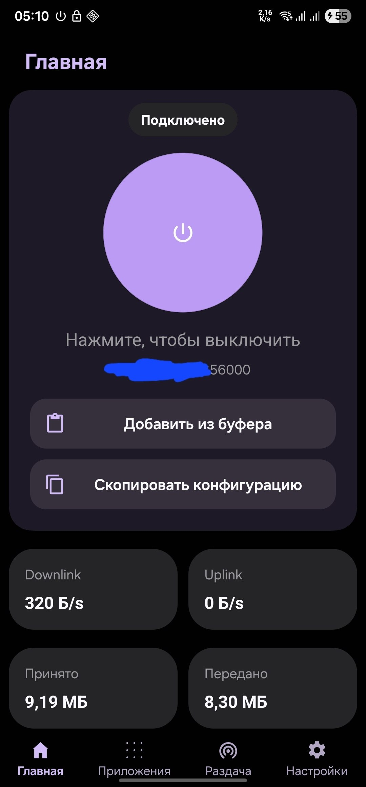
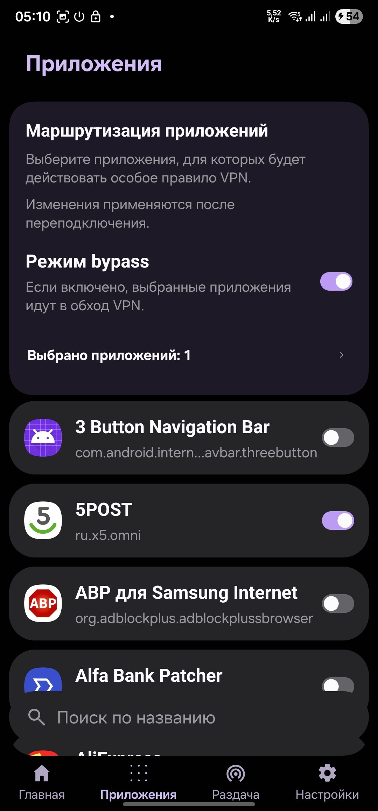
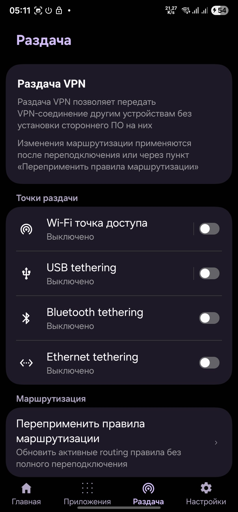
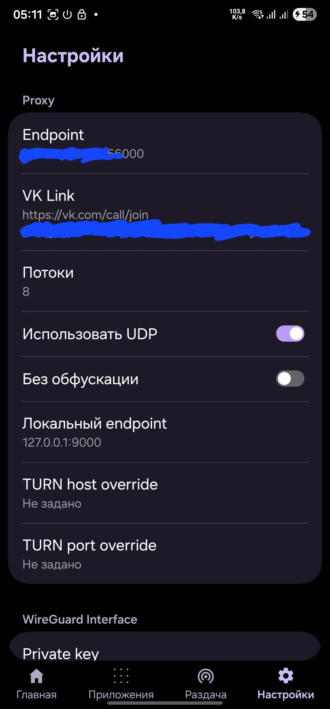

<h1 align="center">WINGS V</h1>
<p align="center">
  <a href="https://t.me/+KrgCVOtwL980ZDky">
    
  </a>
</p>

Клиент Xray, vk-turn-proxy, WireGuard, AmneziaWG в интерфейсе Samsung One UI

## Скриншоты
|                                                                                           |                                                                                           |
| ----------------------------------------------------------------------------------------- | ----------------------------------------------------------------------------------------- |
 | 
 | 

## Что умеет

- работать через `Xray (VLESS)`, `VK TURN + WireGuard или AmneziaWG`, обычные `WireGuard/AmneziaWG`
- показывать статус подключения, IP, страну, провайдера и сетевую статистику
- работать в обычном VPN режиме через `VpnService`
- работать в root режиме для `VK TURN + WireGuard`
- настраивать маршрутизацию по приложениям
- раздавать VPN через Wi-Fi, USB, Bluetooth и Ethernet
- показывать отдельные логи `vk-turn-proxy`, `Xray` и runtime приложения
- импортировать и экспортировать конфигурации через `wingsv://`
- импортировать `vless://` и raw `awg-quick` конфиги
- работать с `Xray` профилями и подписками
- переключаться через launcher actions, внешние intents и Quick Settings tiles

## WINGS V DeX

[WINGS V DeX](https://github.com/WINGS-N/WINGSV_DeX) - настольная версия клиента для Linux и
Windows. Работает так же, как приложение на телефоне: прячет подключение внутри звонков VK, а
для провайдера это выглядит обычным звонком, а не VPN.

- профили добавляются той же ссылкой `wingsv://`, что и в Android-версии
- вход через `VK ID` или анонимно
- маршрутизация по приложениям (`Bypass` / `Whitelist`, только Linux)
- журналы runtime и proxy, обновление из самого приложения
- Linux: `.deb`, `.AppImage`, `.tar.gz` (нужны GTK4 и WebKitGTK 6.0); Windows: `setup.exe` или
  переносимый `.zip`

Сборки лежат на [странице релизов](https://github.com/WINGS-N/WINGSV_DeX/releases).

## Панели управления

Серверную сторону можно держать на любой из 3 панелей - все они умеют выдавать конфигурации,
которые WINGS V импортирует без ручной правки.

### WINGS V Control Panel

[WINGS V Control Panel](https://github.com/WINGS-N/wingsv-panel) - родная панель проекта, она же
работает на официальном домене [v.wingsnet.org](https://v.wingsnet.org). Закрывает 3 задачи:

- **лендинг** - разбирает ссылки `wingsv://` и `vless://` в читаемое превью, а если приложение не
  установлено, предлагает скачать APK последнего релиза. Открыть ссылку сразу в приложении можно
  только с официального домена [v.wingsnet.org](https://v.wingsnet.org) - на своих доменах панель
  показывает превью, а конфиг переносится копированием ссылки
- **админ-панель** - создание клиентов и правка их конфигураций формой или JSON, сидинг нового
  клиента из существующего либо из ссылки, master-config для массового применения общих настроек
- **Guardian** - постоянный WebSocket-канал с устройствами: телеметрия, потоки логов, push новой
  конфигурации и команды (старт/стоп туннеля, обновление подписок и другие)

Ставится одной командой (`install.sh`), бинарники собираются под Linux amd64, arm, arm64 и
riscv64.

### swgPanel

[swgPanel](https://github.com/SanityProtocol/swg-panel) - self-hosted панель для
`WireGuard` / `AmneziaWG` / turn-proxy на одном или нескольких узлах. Каждому пользователю она
выдаёт личную страницу подписки с конфигами и QR по всем его серверам.

### 3x-ui с встроенным vk-turn-proxy

[Панель 3x-ui](https://github.com/WINGS-N/3x-ui) - форк 3x-ui, в который vk-turn-proxy уже вшит
как inbound, так что VK TURN раздаётся рядом с обычными Xray-инбаундами.

## WINGS V VKTP (форк vk-turn-proxy)
Для наилучшего результата на серверной стороне используйте форк [WINGS V VKTP](https://github.com/WINGS-N/vk-turn-proxy). В нём есть WRAP SRTP-mimicry обфускация и in-band доставка ключа, которые клиент WINGS V включает по умолчанию для обхода content-фильтрации VK. Панель 3x-ui выше собирается с этим же форком.

## `wingsv://` ссылки
- Формат: `wingsv://{base64url(0x12 || zlib(protobuf Config))}` - URL-safe base64
  (с паддингом, без переносов) от кадра: байт формата `0x12`, затем zlib-сжатый
  (с zlib-заголовком) protobuf-message `Config` (`wingsv.proto`).
  См. `WingsImportParser.encodeConfig` / `decodePayload`.
- Внутри могут храниться:
  - `VK TURN + WireGuard` настройки
  - `Xray` профили и подписки
  - `VK TURN + AmneziaWG` конфиг

## Что используется

- Java для основного приложения
- OneUI / SESL 8 для интерфейса
- `com.wireguard.android:tunnel` для WireGuard
- `external/vk-turn-proxy` для native `VK TURN` клиента
- `external/libXray` + `external/Xray-core` для `Xray`
- `external/amneziawg-android` для `VK TURN + AmneziaWG`
- `external/VPNHotspot` для root раздачи

## Сборка

Нужно задать credentials для SESL GitHub Packages вне репозитория:

- `seslUser`
- `seslToken`

```bash
# Сразу склонить с submodules
git clone --recurse-submodules https://github.com/WINGS-N/WINGSV.git

# Или после простого clone
# Инициализация submodules
git submodule update --init --recursive
```

Локальная сборка:

```bash
# debug сборка
./gradlew :app:assembleDebug

# релизная сборка
./gradlew :app:assembleRelease
```

Для локальной сборки также нужны:

- Android SDK
- Android NDK
- `protoc`
- `go`
- `gomobile`

## Release

GitHub Actions собирают:

- CI debug build на `main`
- release APK по тегам `v*`

## Special thanks to

- [XTLS](https://github.com/XTLS)
- [cacggghp](https://github.com/cacggghp)
- [Samsung](https://samsung.com)
- [tribalfs](https://github.com/tribalfs)
- [Mygod](https://github.com/Mygod)
- [zx2c4](https://github.com/zx2c4)
- [Amnezia VPN](https://github.com/amnezia-vpn)
